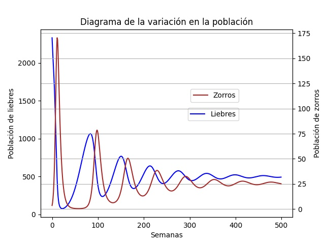
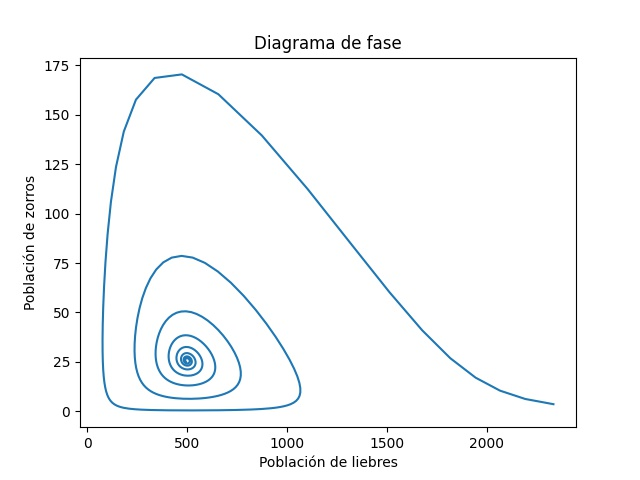
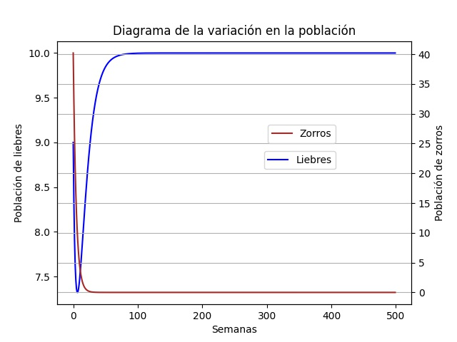
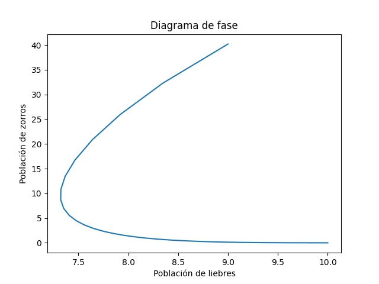
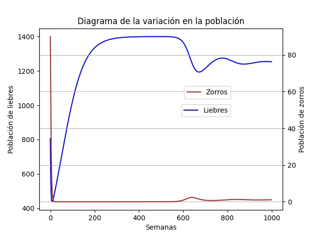
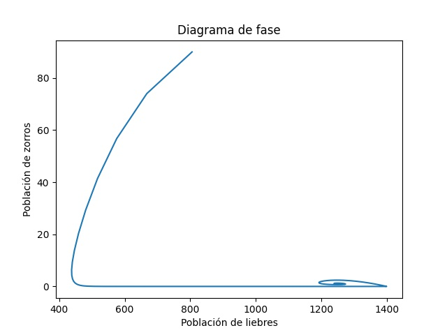

# Informe sobre los algoritmos del sistema 📋

<hr>

El siguiente programa plantea la simulación por medio de gráficos de un sistema no lineal donde por medios de parametros
se obtienen las representaciones gráficas de la simulación.

### Consigna 📌

La consigna del proyecto consta: De que se tienen dos poblaciones, una de zorro y otra de liebres, en el caso de que no
hubiera zorros se presenta gran crecimiento en la población de liebres dependiendo de la capacidad del terreno, ya que
si esta se excede algunas liebres iran muriendo hasta que se estabilice el sistema y en el caso de los zorros si no hay
liebres no tendrán alimentos e iran muriendo. Si tenemos las dos poblaciones juntas los zorros cazaran a las liebres
logrando asi multiplicarse, pero este fenómeno se va a dar por un tiempo porque en algún momento vamos a tener más
zorros y no alcanzaran las liebres para alimentarlos, ocasionando que algunos zorros vaya muriendo de hambre, hasta que
la población de zorros se estabilice.

Una vez planteada la consigna el paso siguiente que realizamos fue plantear las formulas con la ayuda del Ing. Diego
Cordoba basándonos en los apuntes de Puliafito

```
Capacida actual = Capacidad Total - Liebres
Tasa liebres = (Capacidad actual / Capacidad total) * 0.08 * Liebres
Tasa zorro = 0.2 * Zorros
Caza = Zorros * Liebres
Liebres = Liebres + Delta Tiempo * (Tasa liebre - 0.002 * Caza)
Zorros = Zorros + Delta Tiempo * (0.004 * Caza - Tasa zorro)
```

Donde en nuestro caso algunos parámetros vienen por defecto o si se quiere se pueden cambiar, pero estos valores son:

```
Delta tiempo= 1
Liebres = 2500
Zorros = 2
Tasa liebres = 0.08
Tasa zorros = 0.2
Capacidad total = 1400
Semanas = 600
```

Para estos valores vamos a obtener las siguientes graficas:

#### Diagrama de población



Donde podemos observar que el siguiente gráfico representa las dos poblaciones que tenemos, y al
tener 2500 conejos y 2 zorros la probabilidad de caza es muy alta, por eso al principio tenemos un pico en la gráfica de
los zorros y llegamos a tener casi 175 de ellos, es decir, que a medida que aumenta la población de zorros disminuye la
población de liebres y a medidas que disminuye los zorros aumentan las liebres, y asi se realiza este ciclo hasta que
tiende a estabilizarse

#### Diagrama de fase



En cambio en este diagrama se grafica la relación que hay entre las poblaciones, como podemos ver el primer punto que
aparece es a la derecha inferior donde nos indica que tenemos 2500 libres y 2 zorros, donde podemos ver que al avanzar
el tiempo vamos teniendo distintos puntos donde se pueden observar valores para zorros y liebres hasta que casi
convergen en el centro, es decir que se logra una estabilidad entre las poblaciones.

## Simulaciones de prueba

### Primera simulación

Los parámetros que utilizamos para esta simulación fueron:

```
Delta tiempo= 1
Liebres = 10
Zorros = 50
Tasa liebres = 0.08
Tasa zorros = 0.2
Capacidad total = 10
Semanas = 500
```

Dicha simulación nos arrojo los siguientes resultados:

#### Diagrama de población



A comparación de las gráficas explicadas más arriba, podemos observar que en este caso al ser más los zorros se comen a
las liebres pero no son suficientes para la supervivencia, por ende, se extinguen los zorros del terreno dando
lugar al crecimiento de más liebre(limitadas por el terreno).

#### Diagrama de fase



Y en este diagrama observamos que el primer punto es el que se encuentra en la parte superior donde tenemos casi 50
zorroz y 10 liebres y a partir de ahi van disminuyendo los zorros hasta que llegue a cero y las liebres a 10.

### Segunda simulación

En este caso los parámetros que utilizamos fueron:

```
Delta tiempo= 1
Liebres = 1000
Zorros = 100
Tasa liebres = 0.02
Tasa zorros = 0.5
Capacidad total = 1400
Semanas = 1000
```

Y dichas gráficas que mostró fueron:

#### Diagrama de población



En este segundo caso observamos que casi al mismo tiempo disminuyen las dos poblaciones, y que en un principio tuvimos 0
zorros ya que las liebres no alcanzaron para su supervivencia y al pasar esto el nacimiento de nuevas liebres aumento
hasta la semana 600 que podemos que cayo porque se genero un pequeño crecimiento en la población de zorro y asi
pareciera que se encontro la estabilidad entre las dos poblaciones

#### Diagrama de fase



Para este caso vemos que nuestro punto inicial es el de la parte superior donde tenemos casi 800 liebres y 90 zorros, y
a partir de ahi fueron decayendo las dos poblaciones hasta que los zorros dejaron de existir, aumentando la poblacion de
liebres pero cuando teniamos el limite del terreno 1400 notamos que nacieron zorros llevando a la grafica a hacer lo que
se ve reflejado entre lass 1200-1400 liebres y 0-10 zorros.